# COverlap: a Fiji co-localization toolset
This 4 steps Fiji/ImageJ toolset is intended for the 3D co-localization of two nuclear markers. It has been tested on multichannel tiled Z-stack images acquired with a Spinning Disk confocal microscope.

## Brief description of the 4 steps

1. A preliminary creation of Maximum Intensity Projection (MIPs) for each image.
2. A testing step which allows to test the workflow on small portions of images in order to select the best parameters for filtering, background subtraction and thresholding for a given batch.
3. The manual drawing of ROIs for all images in the batch followed by the automatic segmentation and 3D co-localization of the 2 nuclear markers.
4. A reviewing step, where results and segmentations/co-localization masks can be verified, and corrections applied if needed (ROI adjustment, z-stack reslicing, volume estimation correction), with appropriate documentation of any such correction.

## Installation
1. If not already done, download and install Fiji/ImageJ from [https://imagej.net/software/fiji/downloads](https://imagej.net/software/fiji/downloads), following instructions
2. The plugins ImageScience, 3D ImageJ Suite and MorpholibJ need to be installed for the toolset to work. If they are not already, you need to run Help > Update, click on Manage update sites and check the boxes for 
	- the Image Science,
	- the 3D ImageJ Suite,
	- the Java8,
	- and the IJPB-plugins update sites. 
	
	Apply changes and restart ImageJ.

3. Download the [.ijm toolset file](/COverlap_Toolset.ijm)
4. Locate your ImageJ or Fiji folder
5. Put the .ijm toolset file in the Fiji.app > macros > toolsets folder
6. Open ImageJ/Fiji, click on the red double arrow (>>) right of the tools and select the COverlap toolset
7. The 1, 2, 3 and 4 icons appear, you're all set!

			
	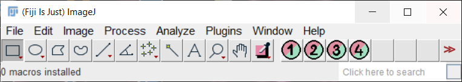

7. A sample dataset that allows the testing of the toolset is available at: 

## How to use it?
Prerequisites:
1. Type of files: 
    - The toolset has been tested on .nd files that are stored in a folder with the reconstructed channels, and that are all named the same (e.g. "Scan1.nd"). It should however work with other formats for z-stack images, such as .tif files, with up to 4 channels.
2. Directory structure and folder naming:
    - You should create two global working directories: one for Images, and one for Results. These two Images and Results folders should be separate. If you have several batches to analyze, you can include them in a higher level directory (such as a Batch 1 folder).
    - The Results directory will initially be empty.
    - The Images directory should contain your images, where each image can be stored in one individual subfolder (such as needed for .nd files). 
    - The names of your sample and of the region analyzed should be included in the name of each image or subfolder (example for sample V1456 if region is ACC: V1456ACCc1).
3.  Example of suitable directory structures:  

					     			[Batch 1]
						/     					\
		 			    [Images]		   			[Results]
				/ 	   	|		\
		[Sample1Region1]	[Sample1Region2]	[Sample2Region1]
		      |				|        	      |
		 Image Files:		 Image Files:	 	Image Files:
		- Scan1.nd		- Scan1.nd		- Scan1.nd
		- Channel1.tif  	- Channel1.tif  	- Channel1.tif
		- Channel2.tif  	- Channel2.tif		- Channel2.tif
		- Channel3.tif		- Channel3.tif		- Channel3.tif
		
		
		
							     	[Batch A]
						/     					\
		 			    [Images]		   			[Results]
					   	|		
					- Sample1Region1.tif
					- Sample1Region2.tif
					- Sample2Region1.tif

## Description of each step:

### Macro 1: Creation of Max Intensity Projection images
This preliminary step creates MIPs of your images that will be reused later, both for ROI drawing and for analysis verification purposes. 
1. Click on the icon 1 and indicate the parent folder that contains all of your images (e.g. Images in our example tree).
2. In the GUI, first indicate if your images are stored in a single folder or if they are stored in one subfolder each. Then, indicate the common substring and/or extension of the images, and which color LUT you want to apply on the different channels of your image (select "None" if you do not have a third and/or fourth channel or if you do not want the channel to appear in the projection).	

	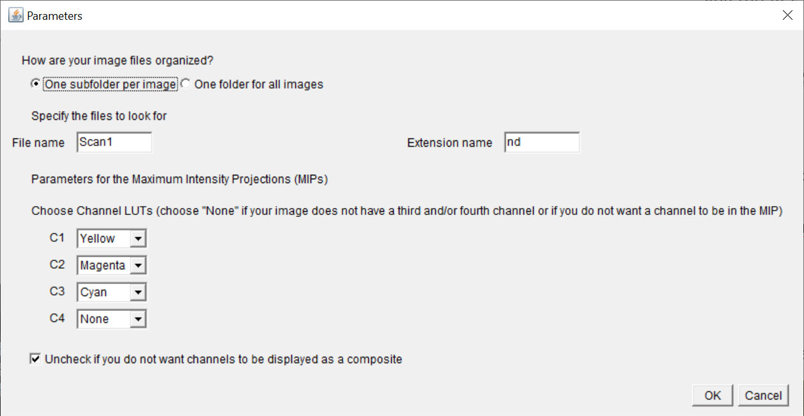

3. When the message "A MIP has been successfully created for all of the images." appears in the Log window, MIPs have been created and stored in each individual image folder. You can open them to see if you are satisfied. You can proceed to step 2 if you are satisfied, or repeat the process with different parameters if you are not.

### Macro 2: Testing of parameters for nuclear markers segmentation
This step allows to test for filtering, background subtraction and thresholding parameters on small portions of images. 
1. Indicate your equivalent of the Images folder, and that of your Results folder.
2. In the GUI, fill in the name of your targets (here the endothelial transcription factor ERG and the proliferation marker EdU), the name of your regions (here ACC for anterior cingulate cortex and CP for parietal cortex), and the name/common substring and extension of your images. If you check the Save parameters box, any GUI that pops up later will be pre-filled with these informations, thanks to a Test_Parameters.txt file that will be saved in your Results folder.	

	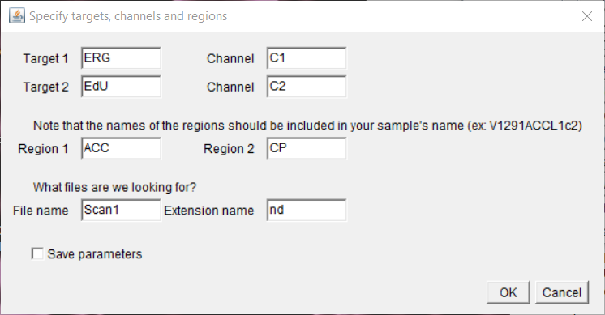	

3. Double click on the desired path in the maxFilesList table to open the MIP of the image you wish to test your parameters on. Click on OK.
4. In the GUI, fill in the various parameters.
	- The minimum Overlap for co-localization % will be ignored in this step and used during Macro 3. It corresponds to a minimum volume of an object (percentage of its total volume) that needs to be overlapping an other object for the pair to be considered as co-localized.
	- Setting a filtering parameter (Median, Gaussian or Background Subtraction Radius) to "0" will have the macro skip this particular filtering step.
	- To be effective, the watershed radius should be around the same size as the radius of your objects.
	- For the tests to run faster, we advise to not select the "Exclude objects on edges" option during this step (it is mostly useful during Step 3 to avoid spurious co-localization events for objects that are only partially included in the ROI). 
	- The first time around, the Ask for ROIs box is checked: you will have to draw a small ROI to perform your testing on. 
	- Checking the Save Parameters box will save those parameters and pre-fill the GUI the next time it pops up. Click OK when you have filled all parameters.

		

5. Draw a (small) ROI, add it to the manager by pressing "T" and click OK: the test begins.
6. When the test is done, you can review the vizualization images for each channel and toggle the outline (channel 2) to see if your parameter selection allows the proper segmentation of your markers of interest. The original channels (used for the vizualization) are also displayed, as well as the processed (filtered and background subtracted) images.

	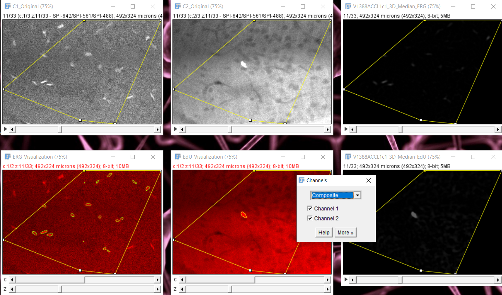			

7. If you wish to test different parameters on the same sample and ROI, click on OK and input new parameters, while leaving Ask for ROIs unckecked. Else, if you wish to analyze a different image or a different ROI, close all images (Maj + W) before clicking on OK, and double-click in the maxFilesList on the image you wish to work on.	
8. Repeat until satisfied, and do not forget to save your parameters if you want to save time in the next step!	

### Macro 3: Segmentation and 3D co-localization of two nuclear fluorescent markers
This step allows the user to sequentially draw and store one ROI per image to analyze (or reads previously stored ROIs) and then proceeds to the actual analysis for the entire batch of images. 
1. Indicate your version of the Images and Results folders, check the targets, channels and regions parameters.
2. Check your segmentation parameters. If you have saved some before, those will be the ones displayed. You can save new ones (bear in mind that the previous ones will be replaced if you do so). When you start the analysis, all of the detection parameters used for the batch will be saved in your Results folder, as a YourImagesFolder_DetectionParameters.txt file. 

	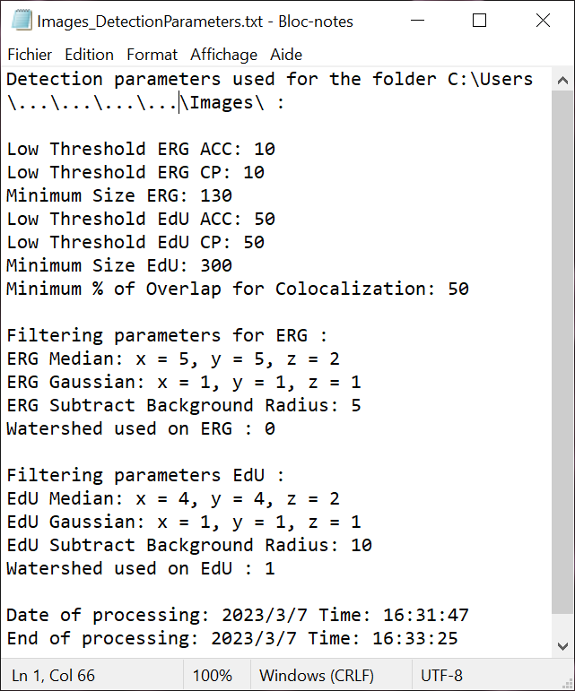	

3. a. Check the Ask for ROIs box if you have not drawn them previously, and click OK. Draw and add a single ROI per image to the ROI manager. Note that this step can take time depending on the complexity and/or number of ROIs to draw, so plan accordingly. The macro will open each MIP in turn for you to draw a ROI, and if no ROI is drawn the corresponding image will be skipped during the analysis. Once all ROIs are drawn, let the computer work (it could take several days depending on the number and size of your images!).

	b. If you are redoing this analysis and wish to keep ROIs that you have previously drawn, uncheck Ask for ROIs before clicking OK. The script will retrieve ROIs stored in the Results folder, and any image that does not have a matching ROI will be ignored (useful if you want to later re-analyze only a subset of images!).

4. The progress will be displayed in the Log window (image being processed/total number of images) and the Results table will be appended each time another image is processed. Shall you interrupt the analysis before its completion, any results for images that have been successfully analyzed will not be lost. 

	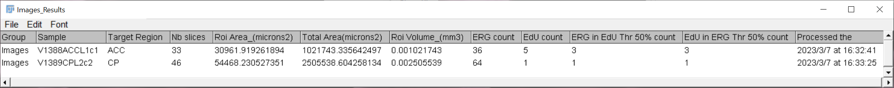	

5. Each time one image is processed, files are added to your Results folder:
	- the appended Results table is saved as a YourImagesFolder_Results.xls file,
	- two types of verification images for each sample analyzed are created:
		- one YourSample_VisualizationMIP.jpg displaying the location of the ROI in red, as well as red outlines around co-localization events,
		- one YourSample_VisualizationComposite.tif image, a z-stack with 4 binary channels: two (red and green) for your target segmentations, one (blue) for the co-localization events (so that any co-localization that has been detected by the script will be conveniently shown in white through the superposition of the 3 channels, see step 4 illustration), and one (gray, initially hidden) that you can toggle on to display discarded overlapping objects that didn't meet the overlap threshold criteria (see step 4).
	-  a set of 3D ROIs of co-localizing objects is also saved (see step 4).
	
6. When all images are analyzed, the log window displays an "Analysis completed!" message and the YourImagesFolder_DetectionParameters.txt file is appended with the date and time of the end of the analysis.   

| Box 1: Image processing description: | 
| ------------- |
| For each channel of interest: |
|  - Contrast enhancement: normalize the image (contrast stretching) with 0.35% pixels saturated, each slice is processed |
|  - Select ROI and crop around it |
|  - Convert the image to 8-bit |
|  - Filter channel: |
|  <ul><li> Apply 3D Median (Plugins > 3D Suite > Filters > 3D Fast Filters)</li><li> Apply 3D Gaussian blur (Process > Filters > Gaussian Blur 3D)</li><li> Apply background subtraction (Process > Subtract Background, smoothing disabled) on the whole stack </li></ul> |
|  - Segment channel: |
|  <ul><li> Apply 3D Simple Segmentation to generate a labeled image (Plugins > 3D Suite > Segmentation > 3D Simple Segmentation)</li><li>(Optional) Apply watershed (Plugins > 3D Suite > Segmentation > 3D Watershed Split)</li><li> (Optional) Exclude objects touching the ROI border </li></ul> |
| Co-localization analysis on the two segmented channels: |
|  - Perform object-based co-localization analysis on the two labeled images (Plugins > 3D Suite > Relationship > 3D MultiColoc), and retrieve pairs of objects for which at least one of the two objects meets the required % of overlap threshold |

### Macro 4: Verification and correction of images
This final step allows the reviewing of your analysis. On top of making sure your parameters selection allowed the proper detection of your features of interest, you can perform corrections such as ROI reshaping (to exlude previously missed bubbles for example), or reslicing of the z-stack (to exlclude out-of-focus stack extremities for example). You can also review co-localization and compare kept and excluded events according to the threshold, and change it if necessary. Another interesting feature is the volume estimation recalculation (see Box 2 with illustration).
1. Indicate your version of the Images and Results folders and check the targets, channels and initial co-localization overlap % parameters.

	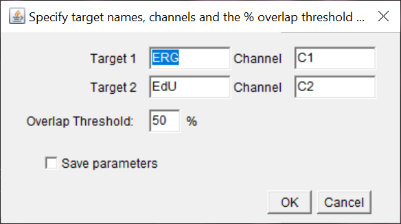

2. Double click on a _Composite.zip image in the list, wait for it to open, then click OK. You can also open the associated .jpg image for visualization purposes, but do not forget to close it before clicking OK.

	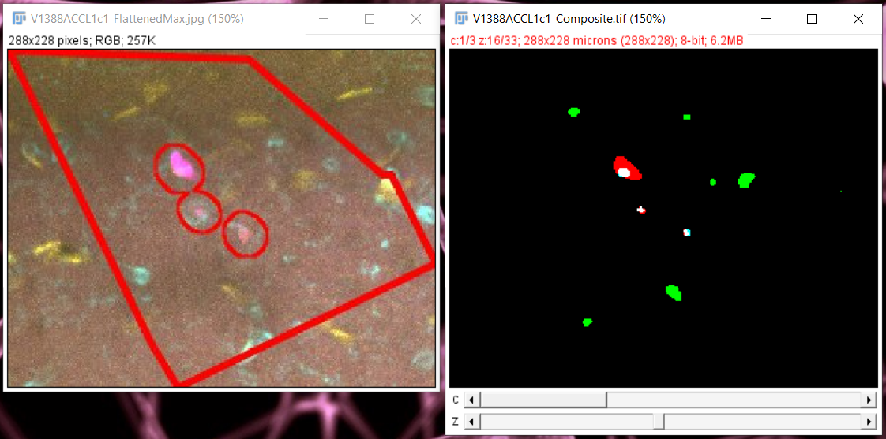	

3. If you want to perform any of the proposed corrections, click on OK.

	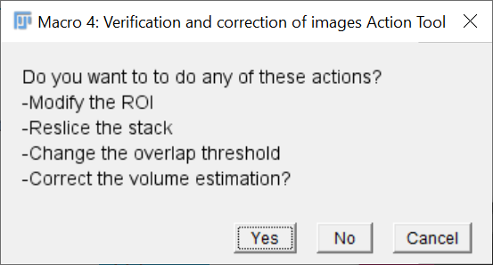

4. Alternatively, if you want to discard the image, click on "No" when the list of possible corrections appears. A window pops up where you can write a brief justification for discarding it, as well as an optional additional comment, that will be added to the Results file. 

	

5. If you have clicked on OK, the Corrections options GUI appears:

	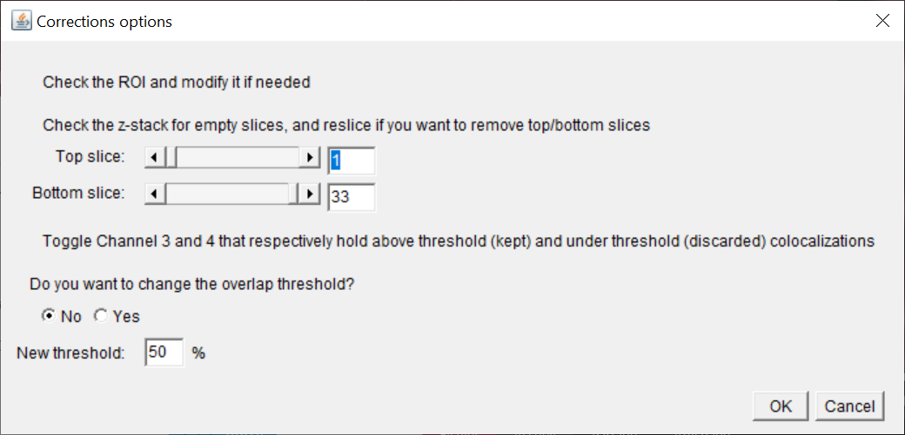

- Make sure that you do not have anything looking odd in your ROI, and reshape it if needed (for example exclude a bubble that you missed earlier and has created a lot of segmented noise). 
- Also check the z-stack: if the top or the bottom of the stack is devoid of any segmentation, it could mean that it was out of focus when acquired: you should exclude these empty slices thanks to the sliders in the GUI (at least two slices must be kept and the top slice number must be inferior to the bottom number). 
- Channel 3 displays the kept co-localizations, and channel 4 displays overlapping objects that were under the overlap threshold. If you wish to change the threshold, select Yes and input the new threshold.
- Add an optional comment if you need to record a note about this image.

7. If you have adjusted the ROI and wish to save and process it, click Yes when prompted (if you have not modified it the prompt will not appear). If you do not want to use this new ROI, Click "No" and the corrections will be performed using the original ROI.

8. Corrections are then performed. The script will warn you if you still have empty slices remaining, and then will recalculate a corrected volume. If modifications of the ROI, z-stack or overlap threshold were performed, the script will also recount the objects and co-localizations in this modified stack and/or ROI, appending the original results file accordingly. The 3D ROIs of colocalizing objects will also be updated.

9. You can compare the visualization images and repeat with the same image until satisfied, or proceed to the next one until you have reviewed all of your batch!

10. Additionally, you can review the 3D ROIs of co-localizing objects, and even perform measurements on them shall your analysis require it. For this, you need to load them in the 3D Manager (Plugins > 3D Suite > 3D Manager, click on Load and select the desired Coloc3DROIs.zip file). You can visualize them on the original image by opening it, opening the ROI file in the regular ROI Manager, cropping the image around this ROI, and pressing Live Roi: ON in the 3D manager. 

	

| Box 2: Estimated volume correction explanation:  | 
| ------------- |
| The analyzed volume is initially estimated in a ROI-shaped cookie-cutter fashion, i.e. based on the area of the ROI multiplied by the number of slices, multiplied by the length of the z step. In case of unevenly mounted or shaped sample (see illustration), this estimation is not very accurate. On the drawing, you can see for example that the area occupied by the sample in the blue rectangle (representing a z-slice) is much smaller than in the orange one, and you can imagine that both do not exactly fit the original ROI drawn on the MIP of the sample. In order to get a better estimation of the analyzed volume, we use a convex hull algorithm that is going to wrap around the detected cells for every z-slice of the sample (purple line on the illustration). Our estimated volume then becomes the sum of these areas that encompass detected cells, multiplied by the length of the z-step. Of course, this is only more suitable than the cookie-cutter estimation provided that you do not have "empty" slices in the middle of your sample that are devoid of  any cells. Ideally, this should only be used if you have a rather ubiquitous marker that is evenly spread in your sample, to avoid "over-correcting" the estimated volume.| 

	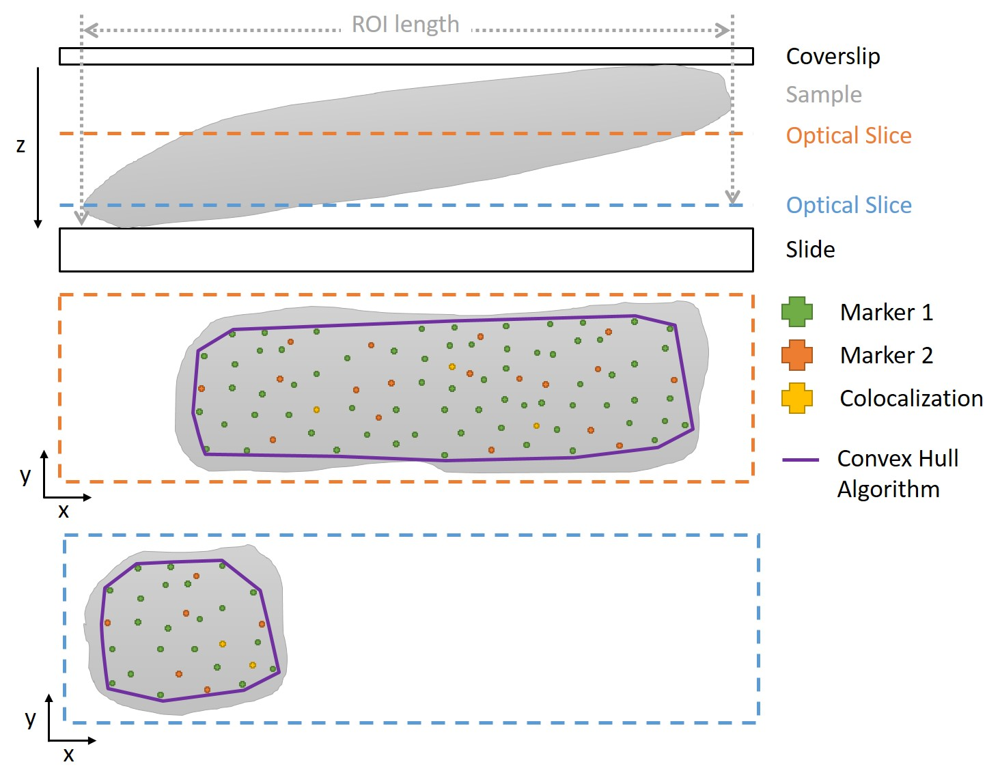

## Results table description
### Initial Macro 3 output

| Group                                    | Sample                       | Target Region | Nb slices          | Roi Area_(unit2) | Total Area(unit2)    | Roi Volume_((unit/1e+9)3)                                  | T1 count             | T2 count            | Overlap % Threshold | T1 in T2 count | T2 in T1 count | Processed the               |
|------------------------------------------|------------------------------|---------------|--------------------|------------------|----------------------|------------------------------------------------------------|----------------------|---------------------|---------------------|----------------|----------------|-----------------------------|
| Parent folder of image / image subfolder | Sample ID, i.e. V1291ACCL1c2 | i.e. ACC, PC  | z-slices in sample | Area of the ROI  | Roi Area * Nb slices | Total Area * Size of z-step / 1e+9, "Cookie-cutter" volume | Nb Target 1 objects  | Nb Target 2 objects | Overlap % Threshold | T1 in T2 count | T2 in T1 count | Year/Month/Day at hh:mm:ss  |

### Appended Macro 4 output

| New Nb slices | New ROI Area | New ROI Volume (unit/1e+9)3 | Corrected Total Area     | Corrected Volume (unit/1e+9)3                | New T1 count | New T2 count | New Overlap % Threshold | New T1 in T2 count | New T2 in T1 count | Resliced?       | New stack                  | ROI changed?    | OverlapThr changed? | Discard justification                 | Appended the                | Comment               |
|---------------|--------------|-----------------------------|--------------------------|----------------------------------------------|--------------|--------------|-------------------------|--------------------|--------------------|-----------------|----------------------------|-----------------|---------------------|---------------------------------------|-----------------------------|-----------------------|
|               |              | New "Cookie-cutter" volume  | Sum of Convex Hull areas | Corrected Total Area * Size of z-step / 1e+9 |              |              |                         |                    |                    | 0 = No, 1 = Yes | [Top slice - bottom slice] | 0 = No, 1 = Yes | 0 = No, 1 = Yes     | User explanation for discarding image | Year/Month/Day at hh:mm:ss  | Optional user comment |

